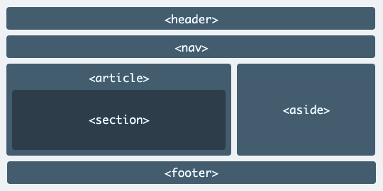
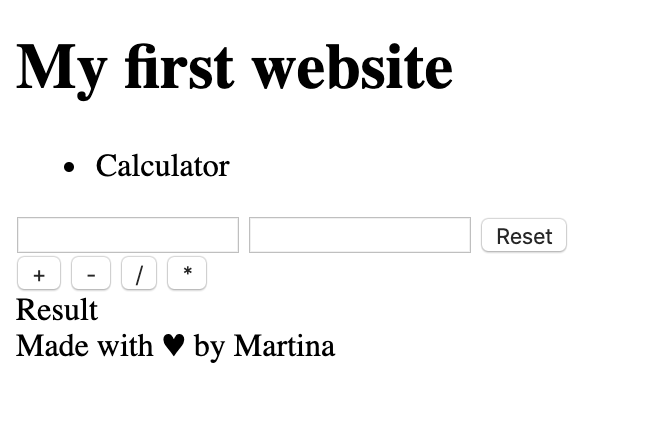

# Html

In this section we will learn the basics of Html and structuring web pages with it. 
We will learn how to write our first lines of Html and how it get rendered inside a Web Browser.

Before we start there are some things to know. 
To *run* Html we don't need to install any special Software. Our Web Browser can read
Html and knows how to render it. 

## 1. Setup and Rendering inside a Web Browser

To be able for the Web Browser to understand Html we need to create a file with 
called `index.html`. Please make sure this file has the extension `.html` otherwise the
Browser won't recognize it as Html.

Open your `index.html` file and add these lines of Html to it:

```html
<!DOCTYPE html>
<html lang="en">
<head>
    <meta charset="UTF-8">
    <title>My first Calculator</title>
</head>
<body>
    <h1> My first website </h1>
</body>
</html>
```

After this we can try to check if everything is working fine by opening this file inside a Web Browser.
If we double click on this file in our Explorer our default Web Browser should open automatically
and displaying `My first website`.

As we can see only the content inside the `h1`-Tag is displayed. Anything else is meta Information
for the Web Browser. It contains all the Information on how to render this content.
For example the line `<meta charset="UTF-8">` tells the Browser which character set should be included.
(Some languages have special characters in their alphabet).

## 2. Structuring the Website

Html contains many different Tags for structuring a website. Some of them even format our text
we want to display. 
We used already the `<h1></h1>`-Tag. And we saw, that our text was rendered bold and big. For that this Tag
a so called `headline`-Tag. 
There are even more: `h2, h3, h4, h5, h6` all of these will render the text in different sizes.

But there are also Html Tags for structuring our webpage. Usually a Webpage has a Header, a Navigation, a Footer and the Main Content.
HTML5 introduces a set of new elements that makes it easy to structure your page through the use of tags like: `<header>`, `<nav>`, `<article>`, `<aside>`, `<footer>`, etc.



Let's start to insert the `<header>`-Tag and we also write a small headline into it:

```html
...
<body>
    <header>
        <h1> My first website </h1>
    </header>
</body>
...
```
Let's extend it with a small Navigationbar after it:

```html
<header> ... </header>
<nav>
    <ul>
        <li>Calculator</li>
    </ul>
</nav>
```

As you will recognize our Web Browser renders this `ul` and `li` with a Bullet Point.
The `ul` means hereby `unordered list` and the `li` is a `list-item` inside it.


We are almost done. Our calculator should be rendered inside the `<section>`-Tag. For that we need to add this Tag after the `header`and after the `nav`-Tag.

```html
<section>
    <p> Calculator </p>
</section>
```

Now we have a perfect structure of our webpage. If you want you can also add the `footer`-Tag for some extra Information like the creator of the Website.

For example:

```html
<footer>
    <div> Made with &hearts; by YOUR_NAME </div>
</footer>
```

Your website should look like this now:


## 3. Creating the Calculator

### 3.1 The Input-Tag

We are ready to start with the Html for our calculator. 
First of all we need two Input fields where we can insert our numbers we want to use for calculation.
Html offers an so called `<input>`-Tag.

The `<input>` tag specifies an input field where the user can enter data.
An input field can vary in many ways, depending on the type attribute.

Examples:
```html
<input type="text">
<input type="number">
<input type="password">
<input type="color">
<input type="date">
```

Since we want to just insert two numbers we need to use the `type="number"`.

Let's add two of this `<input>`-Tag inside our Section:

```html
<section>
    <div>
        <input type="number">
        <input type="number">
    </div>
</section>
```

If we open our Web Browser again we can see that we now have two Input-Elements rendered and we can just type numbers inside them.

### 3.2 The Button-Tag

Last but not least we need to add buttons for all four calculation operations:

- Add
- Minus
- Divide
- Multiply

We need to add four Buttons inside our Section. The Html `Button`-Tag can be used for this purpose:
The `<button>` tag defines a clickable button. 

Example:

```html
<button type="button">Click Me!</button>
```

So let's add for each calculation operation one `Button`-Tag:

```html
<section>
    <div>
        ...
    </div>
    <div>
        <button type="button">+</button>
        <button type="button">-</button>
        <button type="button">/</button>
        <button type="button">*</button>
    </div>
</section>
```

Let's add a third and last `<div>`-Tag as a placeholder for the printed result:

```html
<section>
    <div>
        ...
    </div>
    <div>
        ...
    </div>
    <div>
        Result
    </div>
</section>
```

We might need also another Button for reseting everything. We can add this Button right after the two Input-Fields:

```html

    <div>
        <input type="number">
        <input type="number">
        <button type="button">Reset</button>
    </div>
```
If we added everything correctly it should look like this:




# Bonus

### Images
Let's include a beautiful image inside our website.
We can insert another `section`Tag after our existing:

```html
<section>
    ...
</section>
<section>
    For our Image
</section>
```
To insert an image we need to use the the `image`-Tag:

``

We see it contains a so called `src=".."` attribute. Inside this attribute we have to insert a link to our Image.
This link can be an Image Weblink 
(usually something like `src="https:/www.cat/baby-cat-ginger-kitten-playing-on-couch.jpg"`)
or it can be a relative path to an image on your computer.
(usually it looks like: 'src="img/cat.png"')

We need to insert this `images`-Tag inside our new Section:

```html
<section>
    ...
</section>
<section>
    
</section>
```

If we put the correct url or path to our image it should be displayed in our webpage.

### Hyperlinks
